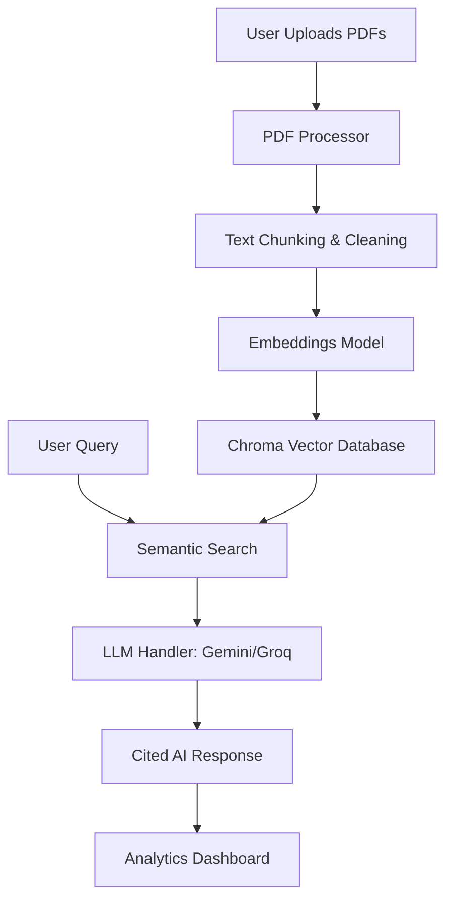

# 📚 PDF Intelligence Hub

[](https://www.python.org/downloads/)
[](https://streamlit.io/)
[](https://www.langchain.com/)
[](https://www.trychroma.com/)
[](https://opensource.org/licenses/MIT)

**PDF Intelligence Hub** is an advanced Retrieval-Augmented Generation (RAG) platform designed to transform static PDF documents into interactive, searchable intelligence. Effortlessly upload multiple documents, ask complex questions, and receive precise, cited answers powered by state-of-the-art LLMs.

---

## 🏗️ Architecture



---

## ✨ Key Features

- 🚀 **Multi-PDF Processing**: Batch upload and process hundreds of pages simultaneously using multi-threaded extraction.
- 💬 **AI-Powered Chat**: Ask questions in natural language and get answers based strictly on your document context.
- 📑 **Smart Citations**: Every answer includes clickable references to the exact PDF name, page number, and heading.
- 📊 **Real-time Analytics**: Monitor query frequency, satisfaction rates, and document reference trends via a built-in dashboard.
- 🤖 **Hybrid LLM Support**: seamlessly switch between **Google Gemini (1.5 Flash)** and **Groq** for optimal speed and context depth.
- 🎨 **Premium UI**: Modern, glassmorphic interface with fluid animations and responsive design.

---

## 🛠️ Tech Stack

- **Frontend**: [Streamlit](https://streamlit.io/) (Custom CSS implementation)
- **RAG Framework**: [LangChain](https://www.langchain.com/)
- **Vector Database**: [ChromaDB](https://www.trychroma.com/)
- **Embeddings**: `sentence-transformers` (HuggingFace)
- **LLMs**: Google Generative AI (Gemini), Groq API
- **Processing**: `PyMuPDF` (fitz), `pdfplumber`, `PyPDF2`

---

## 🚀 Getting Started

### Prerequisites
- Python 3.9 or higher
- API Keys for Google Gemini and/or Groq

### Installation

1. **Clone the Repository**
   ```bash
   git clone https://github.com/Daksh7565/PDF_Analysis.git
   cd PDF_Analysis
   ```

2. **Setup Virtual Environment**
   ```bash
   python -m venv venv
   source venv/bin/scripts/activate  # On Windows: venv\Scripts\activate
   ```

3. **Install Dependencies**
   ```bash
   pip install -r requirements.txt
   ```

4. **Environment Configuration**
   Create a `.env` file in the root directory:
   ```env
   GOOGLE_API_KEY=your_gemini_api_key
   GROQ_API_KEY=your_groq_api_key
   ```

### Running the App
```bash
streamlit run app.py
```

---

## 📂 Project Structure

```text
├── components/          # Core logic components
│   ├── analytics.py     # Usage tracking & metrics
│   ├── llm_handler.py   # LLM integration (Gemini/Groq)
│   ├── pdf_processor.py # Multi-threaded extraction & cleaning
│   └── vector_store.py  # ChromaDB management & retrieval
├── data/                # Local storage (Git-ignored)
│   ├── chroma_db/       # Persistent vector storage
│   ├── uploads/         # Temporary file storage
│   └── logs/            # Analytics logs
├── config.py            # Global application settings
├── app.py               # Main Streamlit entrance
└── requirements.txt     # Project dependencies
```

---

## 🤝 Contributing

Contributions are welcome! Please feel free to submit a Pull Request.

## 📄 License

This project is licensed under the MIT License - see the [LICENSE](LICENSE) file for details.
